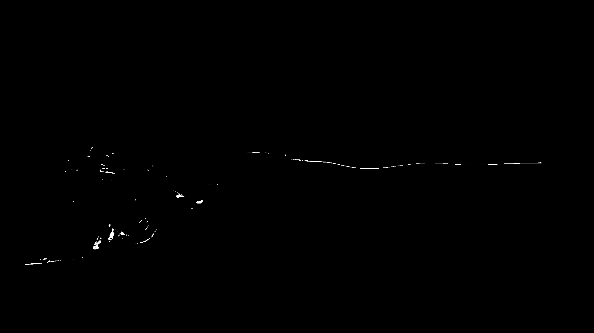

# pyflowtank 




## Installation
First install the dependencies of pyflowtank into your virtual environment. To create a virtual environment type

```
pyhton -m venv <venvname>
```

where venvname is the name you want to give the environment,
After you've activated the environment via

```
. path/to/your/env/activate 
```
in unix and 
```
.\path\to\your\env\scripts\Activate.sh 
```
in windows, run the command

```
pip install -r requirements.txt
```

to install all dependencies into the virtual environment.


## Usage
First, create the folders **videos** and **results** in the root directory of pyflowtank.
Afterwards copy all video files you want to analyse into the **videos** folder.

Run the file **run_extraction.py** to start your analysis. The results will be stored in the **results** folder.
