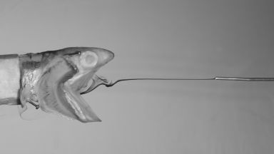

# pyflowtank 




This package can be used to extract inc positions whithin a flowtank. 

## Installation
### Setup a virtual environment
First, make shure python and pip are installed and are added the the PATH variable if you use windows.
To create a virtual environment, type

```
pyhton -m venv <venvname>
```

where ```<venvname>``` is a name you prvide.
After creation you have to activate it via

```
. path/to/your/env/activate 
```
in unix and 
```
.\path\to\your\env\scripts\Activate.sh 
```
in windows.

### Install pyflowtank
At the moment there is no package of pyflowtank. Thus you have to clone it from github.
From within the folder of pyflowtank, run the command

```
pip install -r requirements.txt
```
to install all packages it depends on.

## Usage
Create the folders **videos** and **results** in the root directory of pyflowtank.
Afterwards copy all video files you want to analyse into the **videos** folder.

In **config.py** several parameters can be configured for the inc position extraction.
For example the slice of frames which shall be analysed, as well as landmarks you want to set.
Change the **config.py** in regards of your options. 

Run the file **run_extraction.py** to start your analysis. The results will be stored in the **results** folder.

1. ```_DATA.csv``` containts the data of the upper and lower inc boundaries in the format: ```[n_frames,frame_width*2]``` The frame_width it multiplied by 2 because the upper and lower values are stored in this dimension for every pixel in an alternating manner.
2. ```_LM.csv``` contains the pixel positions of the landmarks.
3. If True in the config file, a gif of the binarized sequence is saved too.

You can use the ```create_gif.py``` script to create a gif of the original videos you analyse.
The excerpt can be defined in the config file and is the same as the one used for analysis.  
## Algorithm
pyflowtank uses image binarisation algorithms to extract the upper and lower position of the inc stream in the tank. 
In a first step several landmarks can be set.
Among these is the position of the needle which releases the inc into the tank.
The needle position, together with the upper jaw position is used to define the boundaries for a crop which is extracted from every video frame. 
This crop is treated differently from the rest of the frame, because of two issues.

1. The whole frame is binarised using a [MOG model](http://www.ai.mit.edu/projects/vsam/Publications/stauffer_cvpr98_track.pdf). It uses the change in pixel values between frame to estimate a background model which is then be used for foreground mask prediction. If the inc positions are static, the they will be included into the background model. This is often the case in laminar flow conditions when no rigid body disturbes the flow. The are from the needle to the mouth often shows this static state of inc.

2. By using a crop which closely sourounds the path of the inc in front of the mouth the backgronud becomes more homogeneous resulting in better seperation results using the [otsu thresholding method](https://ieeexplore.ieee.org/document/6313443).

The crop is insered into the frame afterwards to form a complete binarized image which is then analyzed. 
At the moment the upper and lower inc boundaries are extracted in mm relative to the height of the needle. 
